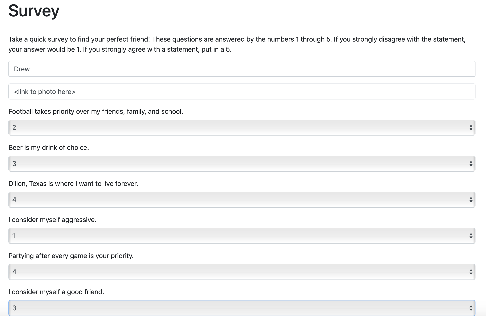
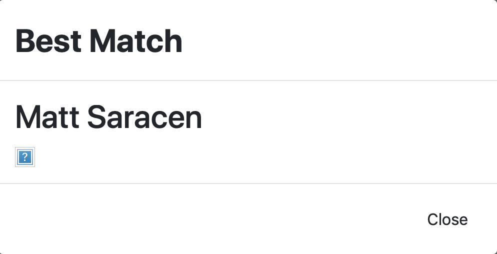

# Friend Finder App

# Creator: Drew Pepin
# Created on: September 27th 2019

## About the App 
The Friend Finder App is an application that allows the user to fill out a survey, and the results will be compared to past users who have taken the survey. The application will then give the user a "Best Friend Match", or someone who is the most compatible based on the survey answers he/she chose. 

## How to use 
 Visit https://friendfinder95.herokuapp.com and fill out the survey questions.
 
## Survey
The survey requires you to enter your name and an image that will be added to the database. You will then answer questions on a 1-5 scale that will help find you your perfect friend.

## Results
Your survey answers will be compared to past users and will find your closest match based on your answers. 

## Technologies used
- javascript
- Nodejs
- Node packages
 - express
 - body-parser
- GIT
- Github
- HTML
- CSS

